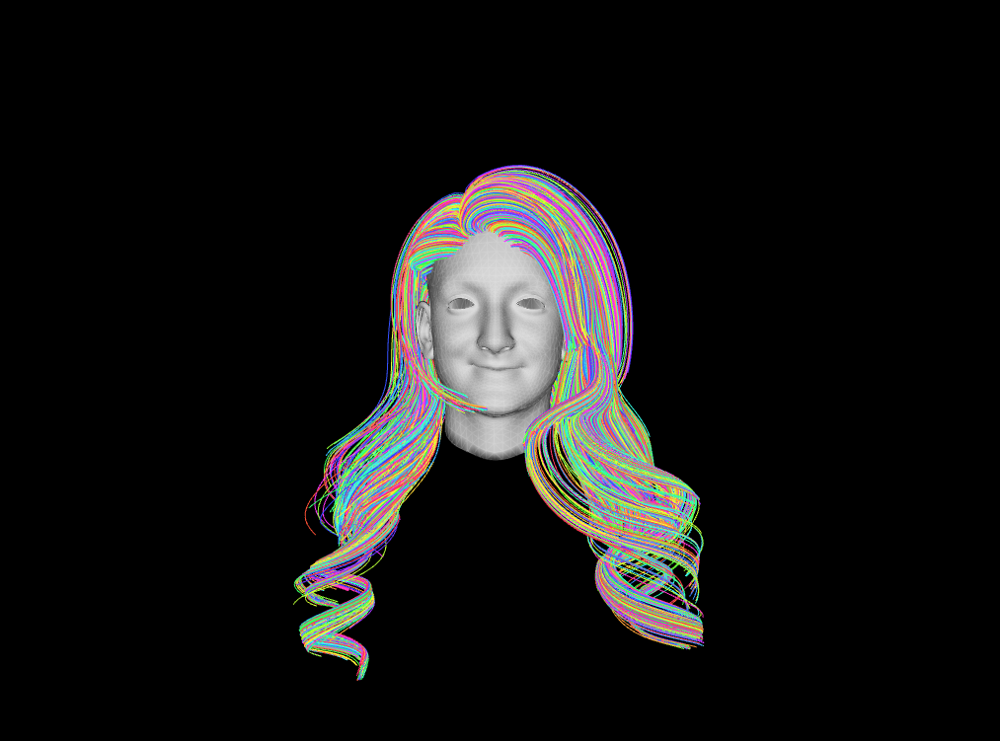

# ofxHairModel

This addon is possible to import hair model and view it.

## Environment
  + Windows 10
  + openFrameworks v0.9.3
  + Visual Studio 2015

## Dependencies
  + ofxHEMesh
  + ofxRay

## Hair Data

+ A Reduced Model for Interactive Hairs  
http://gaps-zju.org/reducedhair/

+ USC-HairSalon: A 3D Hairstyle Database for Hair Modeling (TBD...)  
http://www-scf.usc.edu/~liwenhu/SHM/database.html  
